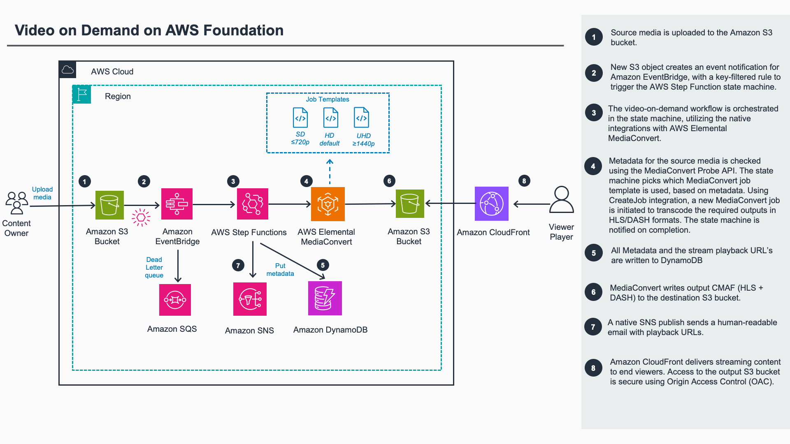

# Guidance for Video on Demand on AWS Foundation

> **v2.0.0** — this release replaces the v1 event-chained Lambda pipeline with an AWS Step
> Functions workflow and removes all solution-authored Lambda functions. See the
> [CHANGELOG](CHANGELOG.md) for what changed and why.

_Deploy a customizable architecture to build a serverless video-on-demand workflow._

---

## About this guidance

Video on Demand on AWS Foundation is a reference implementation that automatically provisions the
Amazon Web Services (AWS) services necessary to build a scalable, distributed video-on-demand
workflow. Drop a video into an Amazon Simple Storage Service (Amazon S3) bucket and the guidance
transcodes it into adaptive-bitrate streaming formats, delivers the output through Amazon
CloudFront, and emails a notification with the playback URLs — all from a single-stack, single
command AWS Cloud Development Kit (AWS CDK) deployment.

*Customers are responsible for making their own independent assessment of the information in this Guidance. This Guidance: (a) is for informational purposes only, (b) represents AWS current product offerings and practices, which are subject to change without notice, and (c) does not create any commitments or assurances from AWS and its affiliates, suppliers or licensors. AWS products or services are provided "as is" without warranties, representations, or conditions of any kind, whether express or implied. AWS responsibilities and liabilities to its customers are controlled by AWS agreements, and this Guidance is not part of, nor does it modify, any agreement between AWS and its customers.*

## Guidance overview

We designed this guidance to help you start encoding video files with AWS Elemental MediaConvert.
You can customize and use this guidance as the starting point to create a more complex workflow.

Out of the box, this guidance helps you to accomplish the following:

- Automatically transcode videos uploaded to Amazon S3 into adaptive-bitrate formats (CMAF,
  served as HLS and DASH) suitable for playback on a wide range of devices.
- Automatically select an SD, HD, or UHD encoding tier based on the source resolution, using an
  AWS Step Functions workflow that probes each uploaded file.
- Customize the MediaConvert encoding settings by editing the per-tier job templates that the
  guidance deploys.
- Store transcoded files in a destination bucket and use Amazon CloudFront to deliver them to end
  viewers.
- Record one item per job (probe metadata, MediaConvert job result, output manifests, playback
  URLs, and the output S3 location) in an Amazon DynamoDB table for querying and downstream
  processing.

### Benefits

**Reference implementation** - Leverage this guidance as a reference implementation to automatically
provision the AWS services necessary to build a scalable, distributed video-on-demand workflow.

**Serverless and observable** - The encode workflow is an explicit AWS Step Functions Standard
state machine with one execution per uploaded video. Every step is a native service integration,
so there are no solution-authored Lambda functions to operate, and each execution's state
transitions, inputs, outputs, and errors are visible in the Step Functions console.

**Customization** - Customize this guidance and then use it as the starting point to create a more
complex workflow.

### Use cases

**Streaming media** - As consumer demand for video streaming increases, media and entertainment
companies are looking for secure and reliable web-based video streaming alternatives to traditional
television. This guidance automatically provisions the services necessary to build a scalable,
distributed architecture that ingests, stores, processes, and delivers video content. Using this
guidance, you can avoid inefficient trial-and-error approaches, and save on time and costs for your
streaming media projects.

**Educational content delivery** - Professional development and educational initiatives create
incentives and can be important revenue generators for nonprofit organizations. This guidance can
help you create modern, scalable content delivery and learning management systems to support your
membership and programming offerings. The guidance streamlines the processes for delivering online
training and learning content.

## What's new in v2

Version 2.0.0 modernizes the guidance while preserving the drop-and-go experience:

- **AWS Step Functions orchestration.** A state machine (one execution per uploaded video) replaces the v1 event-chained Lambdas; to probe the
  source, choose a tier, run the MediaConvert job, record it, and notify.
- **No solution-authored Lambda functions.** Every workflow step is a native Step Functions service integration (MediaConvert Probe, `createJob.sync`, DynamoDB `PutItem`, SNS `Publish`).
- **Source-aware tier selection.** The MediaConvert Probe API reads the source resolution, and selects an SD (<720), HD (720p/1080p), or UHD (≥1440) job template.
- **Best-practice CMAF encoding.** Three MediaConvert JobTemplates (SD/HD/UHD) will generally suit most use cases to output CMAF (fragmented MP4, served as HLS and DASH) with QVBR and Automated ABR.
  SD and HD use H.264/AVC; UHD uses HEVC/H.265. See [Job templates and ABR ladders](#job-templates-and-abr-ladders) which can be further customized.
- **DynamoDB job records.** Completed jobs are written to a DynamoDB table via the native integration — one item per job. 
- **Hardened CloudFront delivery.** Origin Access Control to the private destination bucket, plus CORS using response-header-policy, streaming-appropriate security headers, and HTTP/3.
- **Human-readable notifications.** Success and failure emails are formatted plain text (source filename, playback URLs, or the error cause).

For the full change list see [CHANGELOG.md](CHANGELOG.md).

## Breaking changes from v1

Version 2.0.0 is a major version and is **not** a drop-in replacement for a v1 deployment. Treat
it as a new deployment rather than an in-place stack update, and migrate any external consumers
accordingly.

1. **Per-prefix `job-settings.json` overrides are no longer supported.** The workflow probes the
   source and automatically applies the matching SD/HD/UHD job template. Customize encoding by
   editing the tier templates in `source/cdk/lib/job-templates/{sd,hd,uhd}.json` and redeploying.
2. **Job status moved from `jobs-manifest.json` to DynamoDB.** The single `jobs-manifest.json`
   object in the source bucket no longer exists. Query the DynamoDB jobs table instead (by `Guid`,
   or by status via the GSI).
3. **Deployment tracking changed.** The per-completed-job metric send and the custom-resource
   metrics HTTP POST were removed. Anonymized deployment tracking is now provided solely by the
   `(SO9673)` Solution ID in the CloudFormation template description (see
   [Anonymized data collection](#anonymized-data-collection)).

## Architecture overview

### Architecture reference diagram

Deploying this guidance deploys the following components in your AWS account.



### Architecture highlights

- **Source and destination Amazon S3 buckets** — video uploads land in the source bucket; CMAF
  outputs are written to the destination bucket.
- **Amazon EventBridge rule** — an `Object Created` rule filtered to video suffixes starts one
  Step Functions execution per upload, with an Amazon SQS dead-letter queue for dropped triggers.
- **AWS Step Functions Standard state machine** — probe → check video track → choose quality tier →
  encode (`createJob.sync`) → record job → notify, with a top-level `Catch` and retries with backoff.
- **AWS Elemental MediaConvert** — the Probe API reads source metadata; the `createJob.sync`
  integration runs the encode against the selected per-tier `CfnJobTemplate` and blocks until the
  job reaches a terminal state.
- **Amazon DynamoDB** — one item per job (partition key `Guid`, `Status`-`Timestamp` GSI).
- **Amazon SNS** — publishes the success email with playback URLs (and error notifications).
- **Amazon CloudFront** — serves the outputs from the private destination bucket using Origin
  Access Control.

### Workflow state machine

The encode workflow is a single AWS Step Functions Standard state machine (one execution per
uploaded video). It probes the source, checks a video track is present, selects the SD/HD/UHD
quality tier by resolution, encodes with the native MediaConvert `createJob.sync` integration,
records the job in DynamoDB, and notifies via SNS — with a top-level `Catch` routing any failure to
an error notification. The full definition is in
[`source/cdk/lib/transcode-workflow.asl`](source/cdk/lib/transcode-workflow.asl).

## Cost

You are responsible for the cost of the AWS services used while running this guidance. As deployed,
the cost is dominated by transcoding and delivery:

- **AWS Elemental MediaConvert** — the primary cost driver. Billed per **output-minute**, and each
  source minute produces several adaptive-bitrate renditions (the SD/HD/UHD tier ladder), so output
  minutes are a multiple of input minutes. Consider on-demand vs reserved pricing at scale.
- **Amazon CloudFront** — data transfer out and requests; the main cost of *delivering* the
  streams, and the dominant cost at high viewership.
- **Amazon S3** — storage for source uploads and transcoded outputs, plus request costs.
- **AWS Step Functions (Standard)** — roughly 9 state transitions per video, **Amazon DynamoDB**
  (on-demand writes), **Amazon SNS/SQS**, **AWS KMS**, and **Amazon CloudWatch** — comparatively
  small.

> **Throughput note:** the practical throughput ceiling is the **AWS Elemental MediaConvert
> concurrent-job quota** for your account/Region, not anything in this stack. Request a quota
> increase if you need higher parallelism.

### Example monthly cost

The estimate below is for a small "getting started" workload in the **US West (Oregon)
`us-west-2`** Region, using on-demand pricing as of August 2026. It is an illustrative
estimate, not a quote — your cost varies with source duration, the ABR ladder MediaConvert
generates, and viewership. Always confirm current rates with the
[AWS Pricing Calculator](https://calculator.aws/).

**Example scenario:** ~100 hours of new source video per month (≈600 files averaging 10
minutes), all at 30 fps or below, with a resolution mix of ~75% HD (1080p) and ~25% SD (no
UHD). The transcoded output is delivered to viewers over CloudFront at roughly 2 TB of data
transfer out per month, with about 600 GB of source and output stored in Amazon S3.

| AWS service | Dimension | Est. monthly cost (USD) |
|---|---|---|
| AWS Elemental MediaConvert | 4,500 HD output-min (5-rendition ladder) + 1,500 SD output-min (3-rendition ladder), Professional tier | ~$473 |
| Amazon CloudFront | ~1 TB billable data transfer out (first 1 TB/month is free) + HTTPS requests | ~$87 |
| Amazon S3 | ~600 GB stored in S3 Standard | ~$14 |
| AWS Step Functions | ~5,400 Standard state transitions (first 4,000/month free) | <$0.05 |
| Amazon DynamoDB | ~600 on-demand write request units | <$0.01 |
| Amazon SNS / SQS / KMS / CloudWatch | Notifications, DLQ, KMS key, logs/alarms | ~$1–3 |
| **Total** | | **≈ $575 / month** |

> **How the MediaConvert figure is derived.** MediaConvert bills per **normalized output
> minute**, and every rendition in the adaptive-bitrate ladder is billed separately: the top
> rendition bills at the tier rate and each additional rendition bills at the discounted
> Normalized Transcoding Minutes (NTM) rate. Because the templates use QVBR with Multi-pass HQ
> tuning, they encode in the **Professional tier**. Using the shipped Auto ABR ceilings (HD ≤5
> renditions, SD ≤3) and the `us-west-2` Professional-tier, ≤30 fps, Multi-pass HQ rates
> (HD/AVC $0.042/min base + $0.012/min NTM; SD/AVC $0.021/min base + $0.012/min NTM):
> HD = 4,500 × ($0.042 + 4 × $0.012) = $405.00, and SD = 1,500 × ($0.021 + 2 × $0.012) =
> $67.50, for ~$473. A UHD (4K/HEVC) source is more expensive — $0.168/min base + $0.012/min
> per additional rendition, up to 8 renditions.

Pricing is Region-specific and changes over time — always confirm current rates on each service's
pricing page and the [AWS Pricing Calculator](https://calculator.aws/).

## Prerequisites

* [AWS Command Line Interface](https://aws.amazon.com/cli/)
* Node.js 22.x or later
* AWS CDK (`aws-cdk`) version 2.1128.1 or later
* A CDK-bootstrapped account/Region (run `npx cdk bootstrap` once — see step 2 of
  [How to deploy the guidance](#how-to-deploy-the-guidance))

## How to deploy the guidance

We developed this guidance using the AWS CDK (TypeScript) and one
[AWS Solutions Construct](https://docs.aws.amazon.com/solutions/latest/constructs/welcome.html)
(`aws-cloudfront-s3`). Because v2 has **no solution-authored Lambda functions**, the synthesized
template is self-contained — you deploy it directly from the CDK source as follows.

1. Download or clone this repo, then install dependencies:

   ```
   cd source/cdk
   npm install
   ```

2. **Bootstrap the environment** — required the first time you deploy any CDK app in this
   account/Region. Skip this step if the account/Region is already bootstrapped.

   ```
   npx cdk bootstrap
   ```

   > Without this, `cdk deploy` fails with an error about the CDK toolkit stack not being
   > deployed. See the
   > [CDK bootstrapping guide](https://docs.aws.amazon.com/cdk/v2/guide/bootstrapping.html)
   > for details.

3. **Deploy** with the CDK:

   ```
   npx cdk deploy -c email=you@example.com
   ```

   > **Note:** `-c email=...` sets the admin address that receives the SNS job-status
   > notifications (required; validated at synth). You can instead set `"email"` in the
   > `cdk.json` context and run a bare `npx cdk deploy`. The solution version in the stack
   > description is taken automatically from `source/cdk/package.json` (override with
   > `-c solution_version=vX.Y.Z` if needed).

4. After the stack finishes, **confirm the Amazon SNS subscription** from the email you provided
   before the job-status notifications will arrive.

### Run unit tests for customization

Before deploying a customized copy, run the unit tests to confirm your changes still pass:

```
cd deployment
chmod +x ./run-unit-tests.sh
./run-unit-tests.sh
```

## Job templates and ABR ladders

The guidance ships three AWS Elemental MediaConvert job templates — one per quality tier — in
`source/cdk/lib/job-templates/{sd,hd,uhd}.json`. They are deployed as CDK-managed
`AWS::MediaConvert::JobTemplate` resources. After probing each source file, the state machine's
`Choose Quality Tier` step maps the source height to a tier and runs the matching template:

| Source height | Tier | Template file |
| --- | --- | --- |
| below 720 (e.g. 480, 576) | SD | `sd.json` |
| 720–1439 (720p, 1080p) | HD | `hd.json` |
| 1440 and above (1440p, 2160p/4K) | UHD | `uhd.json` |

### Automated ABR (Auto ABR)

All three templates use MediaConvert **Automated ABR (Auto ABR)**. Instead of you hand-defining
each rendition's resolution and bitrate, MediaConvert analyzes the source and automatically builds
an optimized adaptive-bitrate (ABR) ladder — choosing the number of renditions and their
resolution/bitrate for the best quality across the bandwidth range. You constrain it with three
knobs: **Max renditions**, **Max ABR bitrate** (the ceiling for the top rendition), and **Max
quality level** (a QVBR quality target, 1–10). Combined with **QVBR** (Quality-Defined Variable
Bitrate) rate control and **Multi-pass HQ** tuning, the ladder targets a consistent perceptual
quality rather than a fixed bitrate. Learn more:

- [Automated ABR — MediaConvert User Guide](https://docs.aws.amazon.com/mediaconvert/latest/ug/auto-abr.html)
- [How MediaConvert generates your Automated ABR stack](https://docs.aws.amazon.com/mediaconvert/latest/ug/auto-abr-rules.html)
- [QVBR rate control mode](https://docs.aws.amazon.com/mediaconvert/latest/ug/cbr-vbr-qvbr.html)
- [Using the Automated ABR feature (AWS Media blog)](https://aws.amazon.com/blogs/media/using-automated-abr-with-aws-elemental-mediaconvert/)
- [Introduction to Video Quality in AWS Elemental MediaLive (PDF)](https://d1.awsstatic.com/AWS_Elemental_docs/Introduction_to_Video_Quality_in_AWS_Elemental_MediaLive.pdf)
  — written for MediaLive, but the video-quality principles (QVBR, bitrate vs. resolution,
  ABR ladder design) apply broadly to MediaConvert VOD encoding as well.

### Auto ABR constraints and codec settings per tier

The templates do **not** hard-code the rendition ladder. The values below are the **codec choices
and the constraints fed into Auto ABR** — MediaConvert generates the actual ladder (how many
renditions, and each one's resolution and bitrate) at encode time, within these bounds. For
example, the UHD template allows up to 8 renditions, but a given 4K source may produce fewer if
MediaConvert determines that is optimal.

All tiers output a single **CMAF** package (fragmented MP4, served as both HLS and DASH),
10-second segments / 2-second fragments, a 2-second closed GOP, AAC stereo audio at 48 kHz, and
QVBR / Multi-pass HQ rate control. Note there is no per-codec `QvbrQualityLevel` — the QVBR quality
target for the ladder comes from `AbrSettings.MaxQualityLevel`. The tiers differ by video codec and
ABR ceilings:

| Setting (template key) | SD (`sd.json`) | HD (`hd.json`) | UHD (`uhd.json`) |
| --- | --- | --- | --- |
| Video codec (`CodecSettings.Codec`) | **AVC (H.264)** | **AVC (H.264)** | **HEVC (H.265)** |
| Rate control (`RateControlMode` + `QualityTuningLevel`) | QVBR, Multi-pass HQ | QVBR, Multi-pass HQ | QVBR, Multi-pass HQ |
| Max renditions (`AbrSettings.MaxRenditions`) | 3 | 5 | 8 |
| Max ABR bitrate (`AbrSettings.MaxAbrBitrate`) | 3 Mbps | 8.5 Mbps | 18 Mbps |
| Max quality level (`AbrSettings.MaxQualityLevel`) | 7 | 7 | 10 |
| Audio (`AacSettings`, AAC 2.0, 48 kHz) | 64 kbps | 128 kbps | 128 kbps |
| Segment / fragment (`CmafGroupSettings`) | 10 s / 2 s | 10 s / 2 s | 10 s / 2 s |

Notes:

- **HD uses AVC (H.264)** for the broadest device and player compatibility.
- **UHD uses HEVC (H.265)** — at 4K, HEVC's higher compression efficiency delivers the same
  perceptual quality at a lower bitrate than H.264.
- **SD uses the same Auto ABR configuration as HD** (H.264), only with lower ABR ceilings. It is a
  deliberately simple starting point — modify it to suit your SD delivery needs (for example a
  different codec, bitrate ceiling, or rendition count).

## Customizing the encoding

The guidance selects a tier automatically by probing each source file, so no per-upload settings
file is required. To change the encoding, edit the per-tier templates in
`source/cdk/lib/job-templates/{sd,hd,uhd}.json` and redeploy (`npx cdk deploy`). Common changes:

- **Codec** — switch a tier's video codec by changing `VideoDescription.CodecSettings` (e.g.
  `Codec: "H_264"` with `H264Settings`, or `Codec: "H_265"` with `H265Settings`). Most rate-control
  fields (`RateControlMode`, `QualityTuningLevel`, `GopSize`, `GopSizeUnits`) map 1:1 between the
  two codecs.
- **ABR ladder** — tune `AutomatedEncodingSettings.AbrSettings`: `MaxRenditions`, `MaxAbrBitrate`,
  and `MaxQualityLevel`. To define renditions manually instead of using Auto ABR, remove
  `AutomatedEncodingSettings` and add explicit `Outputs` entries.
- **Audio** — edit the AAC output's `AudioDescriptions[].CodecSettings.AacSettings` (`Bitrate`,
  `CodingMode`, `SampleRate`), or add additional audio outputs / renditions (for example a second
  language or a higher-bitrate stereo track).
- **Packaging** — adjust `CmafGroupSettings` (segment/fragment length, HLS vs DASH manifests) or
  add other output groups.

The quickest way to author a valid settings body is to configure a job in the MediaConvert console,
run it once, then **export the job's settings JSON** and adapt it into the template. Before
deploying a customized copy, run the unit tests (see above) — and note that invalid encoding
settings will cause the MediaConvert job (not the deploy) to fail at runtime.

## Known limitations

The basic guidance intentionally scopes some inputs out. These are documented so the behavior is
predictable; you can extend the tier templates and the state machine definition to handle them:

- **UHD HDR** sources are tonemapped to SDR — the tier job templates do not carry HDR signaling.
- Only the **default audio track** is encoded — additional language or M&E tracks are dropped.
- **Captions** (CEA-608/708, sidecar, IMSC) are out of scope and are not passed through.
- **Interlaced** sources are not deinterlaced.

## Troubleshooting

The email address you provide when deploying this guidance receives notifications both when
MediaConvert jobs complete successfully and when the workflow fails.

If you are notified about a MediaConvert job failure, complete the following steps.

1. From the account where the guidance is deployed, sign in to the AWS Elemental MediaConvert
   console.
2. In the navigation pane, select **Jobs**.
3. Select the **job ID** of the job that failed.
4. On the **Job Summary** page, review the **Overview** section for an error message with more
   information on why the job failed. On this page, you can also find MediaConvert error codes for
   details on how to address the issue.

If the error is not a MediaConvert job failure, the AWS Step Functions workflow encountered an
error (for example, an unsupported source file or the DynamoDB record step). Open the state machine
in the Step Functions console and inspect the failed execution: each state's input, output, and
error is visible in the execution history, and the SNS error notification includes the failing
execution's details.

## How to uninstall the guidance

You can uninstall this guidance from the AWS Management Console or by using the AWS CLI. You must
manually delete the S3 buckets and Amazon CloudWatch logs created by this guidance. AWS guidances
do not automatically delete these resources in case you have stored data to retain.

For more detailed instructions, see the [guidance implementation guide][IG].

## Anonymized data collection

This guidance does not send operational metrics. Anonymized deployment tracking is provided by the
`(SO9673)` Solution ID in the CloudFormation template description, which AWS harvests
automatically when the template is deployed. There is no runtime metrics call and no per-job data
is collected or transmitted.

## Security

This Guidance is a reference implementation intended to help you get started. It is provided for
demonstration and educational purposes and requires additional hardening and security review
before use with production content. To report a security issue, see
[CONTRIBUTING](CONTRIBUTING.md#security-issue-notifications).

### Shared responsibility

Security and compliance are a [shared responsibility](https://aws.amazon.com/compliance/shared-responsibility-model/)
between AWS and you. AWS is responsible for security *of* the cloud (the infrastructure and managed
services). You are responsible for security *in* the cloud: IAM policies, network access,
encryption key management, content protection, and any compliance requirements specific to your
workload.

### Security considerations for production

The following are intentionally simplified in this reference implementation. Evaluate and address
them before using this Guidance in production:

- **Content access control (evaluate first).** This Guidance does **not** implement authentication
  or authorization for playback. Anyone who obtains a playback URL can access the video. Playback
  paths use 128-bit random GUIDs (impractical to enumerate), but URLs are not otherwise protected
  and can be freely shared. For restricted content, use
  [Secure Media Delivery at the Edge](https://aws.amazon.com/solutions/implementations/secure-media-delivery-at-the-edge-on-aws/)
  or an end-user authentication flow.
- **CORS.** The CloudFront distribution and destination bucket allow all origins
  (`Access-Control-Allow-Origin: *`, without credentials) to support browser playback from any
  site. If your content is not meant for unrestricted third-party embedding, restrict the allowed
  origins in the CloudFront `ResponseHeadersPolicy`.
- **TLS minimum version.** The distribution uses the default `*.cloudfront.net` certificate, which
  forces CloudFront's default (`TLSv1`) security policy. To raise the minimum TLS version, attach a
  custom domain with an AWS Certificate Manager certificate and set `MinimumProtocolVersion`
  (for example, `TLSv1.2_2021`).
- **AWS WAF.** No web application firewall is attached. For production, associate an AWS WAF WebACL
  with the CloudFront distribution to filter malicious requests and apply rate limiting.
- **Geographic restriction.** No CloudFront geo restriction is configured. Enable it if you have
  content-licensing or regulatory requirements.
- **Encryption keys.** S3 objects use S3-managed encryption (SSE-S3) and the DynamoDB table uses
  AWS-managed encryption. For independent key management, audit trails, or cross-account key
  policies, switch to AWS KMS customer-managed keys (the SNS topic already uses a customer-managed
  KMS key with rotation).
- **Log access.** Step Functions execution logging is enabled at the `ALL` level with execution
  data (which includes S3 object paths and job parameters) to aid debugging. Restrict access to the
  CloudWatch log group with IAM, and consider reducing the log level for sensitive workloads.

### Automated scanning

cdk-nag runs on every synth (the `AwsSolutionsChecks` aspect), and the repo ships
[CodeQL](.github/workflows/codeql.yml) and [Dependabot](.github/dependabot.yml) configurations.

## License information

Copyright Amazon.com, Inc. or its affiliates. All Rights Reserved.

Licensed under the Apache License, Version 2.0 (the "License"); you may not use this file except in
compliance with the License. You may obtain a copy of the License at
[http://www.apache.org/licenses/LICENSE-2.0](http://www.apache.org/licenses/LICENSE-2.0).

Unless required by applicable law or agreed to in writing, software distributed under the License is
distributed on an "AS IS" BASIS, WITHOUT WARRANTIES OR CONDITIONS OF ANY KIND, either express or
implied. See the License for the specific language governing permissions and limitations under the
License.

[IG]: https://docs.aws.amazon.com/guidances/latest/video-on-demand-on-aws-foundation/welcome.html
